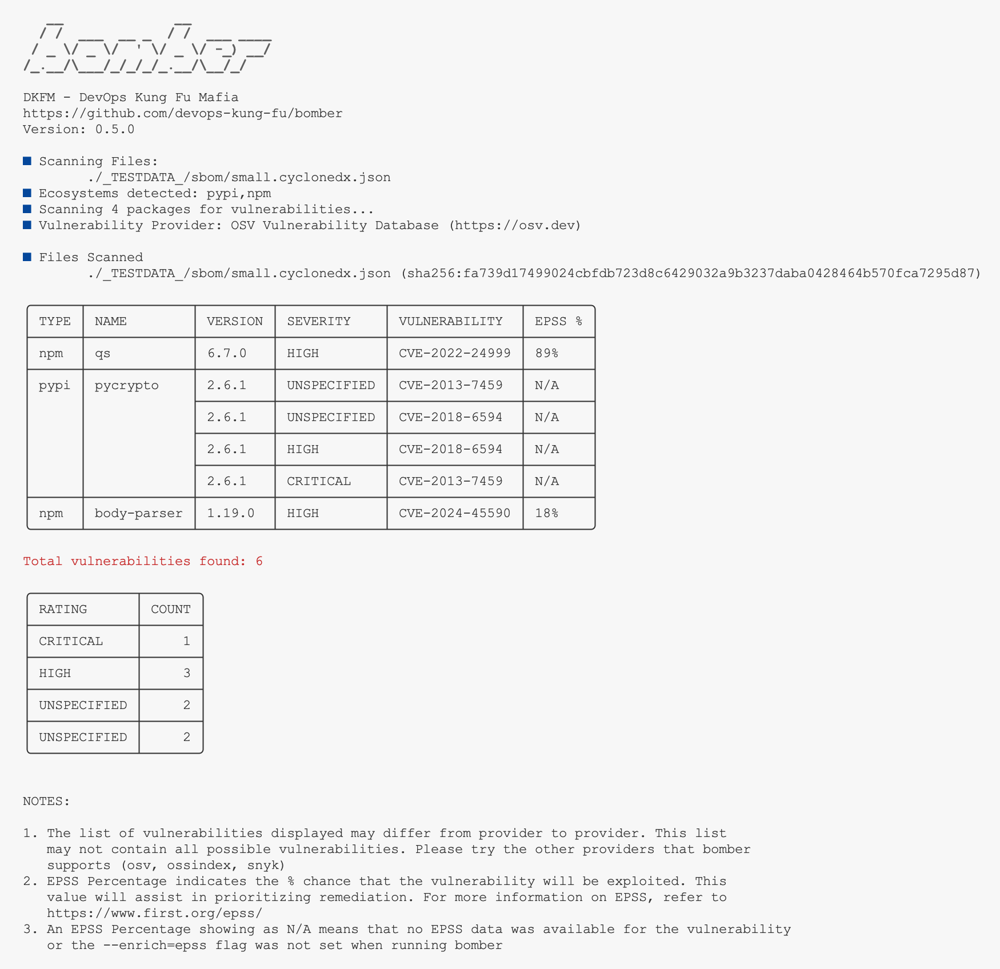
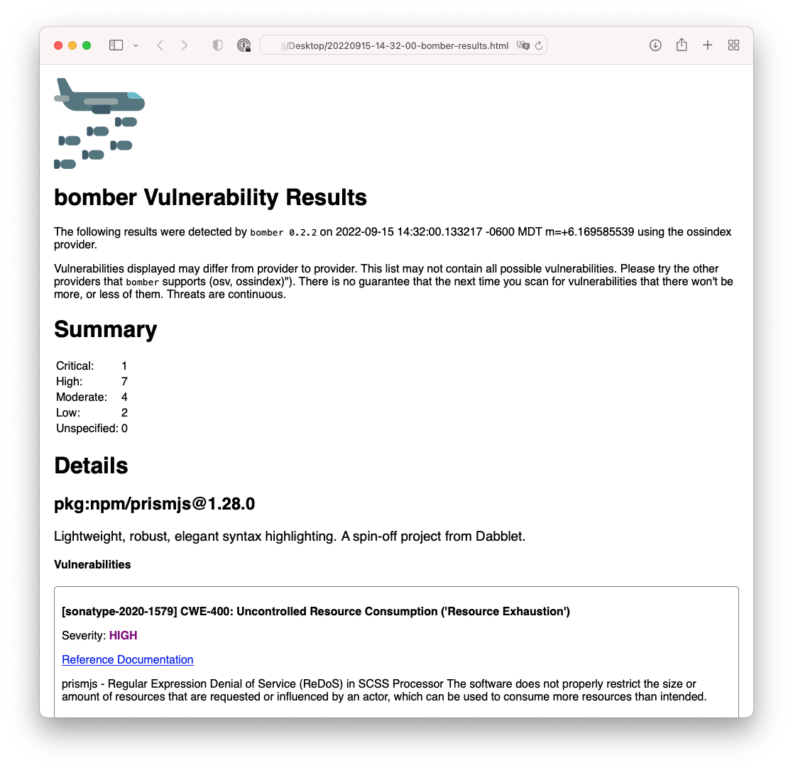
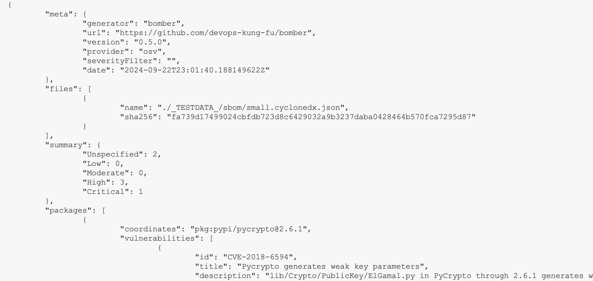

# bomber
[](CONTRIBUTING.md)
 
[](https://goreportcard.com/report/github.com/devops-kung-fu/bomber) 
[](https://bestpractices.coreinfrastructure.org/projects/6409)
[](https://codecov.io/gh/devops-kung-fu/bomber) 
[](sbom/bomber.cyclonedx.json)


```bomber``` is an application that scans SBoMs for security vulnerabilities.

## Overview

So you've asked a vendor for an Software Bill of Materials (SBOM) for one of their products, and they provided one to you in a JSON file... now what? 

The first thing you're going to want to do is see if any of the components listed inside the SBOM have security vulnerabilities. This will help you identify what kind of risk you will be taking on by using the product. Finding security vulnerabilities for components identified in an SBOM is exactly what ```bomber``` is meant to do. It can read any JSON based [SPDX](https://spdx.dev), [CycloneDX](https://cyclonedx.org), or [Syft](https://github.com/anchore/syft) formatted SBOM and tell you pretty quickly if there are any vulnerabilities. 

### What SBOM formats are supported?

There are quite a few SBOM formats available today. ```bomber``` supports the following:

- [SPDX](https://spdx.dev)
- [CycloneDX](https://cyclonedx.org)
- [Syft](https://github.com/anchore/syft)

## Providers

```bomber``` supports multiple sources for vulnerability information. We call these *providers*. Currently, ```bomber``` uses [OSV](https://osv.dev) as the default provider, but you can also use the [Sonatype OSS Index](https://ossindex.sonatype.org). 

Please note that *each provider supports different ecosystems*, so if you're not seeing any vulnerabilities in one, try another. It is also important to understand that each provider may report different vulnerabilities. If in doubt, look at a few of them.

If ```bomber``` does not find any vulnerabilities, it doesn't mean that there aren't any. All it means is that the provider being used didn't detect any, or it doesn't support the ecosystem. Some providers have vulnerabilities that come back with no Severity information. In this case, the Severity will be listed as "UNDEFINED"

### What is an ecosystem?

An ecosystem is simply the package manager, or type of package. Examples include rpm, npm, gems, etc. Each provider supports different ecosystems.

### OSV 

[OSV](https://osv.dev) is the default provider for ```bomber```. It is an open, precise, and distributed approach to producing and consuming vulnerability information for open source. 

**You don't need to register for any service, get a password, or a token.** Just use ```bomber``` without a provider flag and away you go like this:

``` bash
bomber scan test.cyclonedx.json
```

#### Supported ecosystems

At this time, the [OSV](https://osv.dev) supports the following ecosystems:

- Android
- crates.io
- Debian
- Go
- Maven
- NPM
- NuGet
- Packagist
- PyPI
- RubyGems

and others...

#### OSV Notes

The OSV provider is pretty slow right now when processing large SBOMs. At the time of this writing, their batch endpoint is not functioning, so ```bomber ``` needs to call their API one package at a time. 

Additionally, there are cases where OSV does not return a Severity, or a CVE/CWE. In these rare cases, ```bomber``` will output "UNSPECIFIED", and "UNDEFINED" respectively.

### Sonatype OSS Index

In order to use ```bomber``` with the [Sonatype OSS Index](https://ossindex.sonatype.org) you need to get an account. Head over to the site, and create a free account, and make note of your ```username``` (this will be the email that you registered with). 

Once you log in, you'll want to navigate to your [settings](https://ossindex.sonatype.org/user/settings) and make note of your API ```token```. **Please don't share your token with anyone.**

#### Supported ecosystems

At this time, the [Sonatype OSS Index](https://ossindex.sonatype.org) supports the following ecosystems:

- Maven
- NPM
- Go
- PyPi
- Nuget
- RubyGems
- Cargo
- CocoaPods
- Composer
- Conan
- Conda
- CRAN
- RPM
- Swift

## Installation

### Mac

You can use [Homebrew](https://brew.sh) to install ```bomber``` using the following:

``` bash
brew tap devops-kung-fu/homebrew-tap
brew install devops-kung-fu/homebrew-tap/bomber
```

If you do not have Homebrew, you can still [download the latest release](https://github.com/devops-kung-fu/hookz/releases) (ex: ```bomber_0.1.0_darwin_all.tar.gz```), extract the files from the archive, and use the ```bomber``` binary.  

If you wish, you can move the ```bomber``` binary to your ```/usr/local/bin``` directory or anywhere on your path.

### Linux

To install ```bomber```,  [download the latest release](https://github.com/devops-kung-fu/hookz/releases) for your platform and install locally. For example, install ```bomber``` on Ubuntu:

```bash
dpkg -i bomber_0.1.0_linux_arm64.deb
```

## Using bomber

You can scan either an entire folder of SBOMs or an individual SBOM with ```bomber```.  ```bomber``` doesn't care if you have multiple formats in a single folder. It'll sort everything out for you.

### Single SBOM scan

``` bash
# Using OSV (the default provider) which does not require any credentials
bomber scan spdx.sbom.json

# Using a provider that requires credentials (ossindex)
bomber scan --provider=xxx --username=xxx --token=xxx spdx-sbom.json
```
If the provider finds vulnerabilities you'll see an output similar to the following:



If the provider doesn't return any vulnerabilities you'll see something like the following:


### Entire folder scan

This is good for when you receive multiple SBOMs from a vendor for the same product. Or, maybe you want to find out what vulnerabilities you have in your entire organization. A folder scan will find all components, de-duplicate them, and then scan them for vulnerabilities.

```bash
# scan a folder of SBOMs (the following command will scan a folder in your current folder named "sboms")
bomber scan --username=xxx --token=xxx ./sboms
```

You'll see a similar result to what a Single SBOM scan will provide.

### Output to HTML

If you would like a readable report generated with detailed vulnerability information, you can utilized the ```--output``` flag to save a report to an HTML file.

Example command:

``` bash
bomber scan bad-bom.json --output=html
```

This will save a file in your current folder in the format "YYYY-MM-DD-HH-MM-SS-bomber-results.html". If you open this file in a web browser, you'll see output like the following:



### Output to JSON

```bomber``` can output vulnerability data in JSON format using the ```--output``` flag. The default output is to STDOUT. There is a ton of more information in the JSON output than what gets displayed in the terminal. You'll be able to see a package description and what it's purpose is, what the vulnerability name is, a summary of the vulnerability, and more.



Example command:

``` bash
bomber scan bad-bom.json --output=json
```

### Advanced stuff

If you wish, you can set two environment variables to store your credentials, and not have to type them on the command line. Check out the [Environment Variables](####Environment-Variables) information later in this README.

### Messing around

If you want to kick the tires on ```bomber``` you'll find a selection of test SBOMs in the [test](sbom/test/) folder. 

## Known Issues

- Hate to say it, but SPDX is wonky. If you don't get any results on an SPDX file, try using a CycloneDX file. This is something we are investigating. One of the problems is that ```bomber``` uses [PURLs](https://github.com/package-url/purl-spec) from SBOM's to send to a provider to retrieve vulnerabilities. SPDX has an odd way of treating PURLs as they are embedded in External References deep in the file format. If a PURL isn't there, nothing will scan.
- OSV. It's great, but the API is also wonky. They have a batch endpoint that would make it a ton quicker to get information back, but it doesn't work. ```bomber``` needs to send one PURL at a time to get vulnerabilities back, so in a big SBOM it will take some time.
- OSV has another issue where the ecosystem doesn't always return vulnerabilities when you pass it to their API. We had to remove passing this to the API to get anything to return. They also don't echo back the ecosystem so we can't check to ensure that if we pass one ecosystem to it, that we are getting a vulnerability for the same one back.

## Development

### Overview

In order to use contribute and participate in the development of ```bomber``` you'll need to have an updated Go environment. Before you start, please view the [Contributing](CONTRIBUTING.md) and [Code of Conduct](CODE_OF_CONDUCT.md) files in this repository.

### Prerequisites

This project makes use of [DKFM](https://github.com/devops-kung-fu) tools such as [Hookz](https://github.com/devops-kung-fu/hookz), [Hinge](https://github.com/devops-kung-fu/hinge), and other open source tooling. Install these tools with the following commands:

``` bash
go install github.com/devops-kung-fu/hookz@latest
go install github.com/devops-kung-fu/hinge@latest
go install github.com/kisielk/errcheck@latest
go install golang.org/x/lint/golint@latest
go install github.com/fzipp/gocyclo@latest
```
### Getting Started

Once you have installed [Hookz](https://github.com/devops-kung-fu/hookz) and have cloned this repository, execute the following in the root directory:

``` bash
hookz init --verbose --debug --verbose-output
```
This will configure the ```pre-commit``` hooks to check code quality, tests, update all dependencies, etc. before code gets committed to the remote repository.

### Debugging

The project is set up to work really well with [Visual Studio Code](https://code.visualstudio.com). Once you open the ```bomber``` folder in Visual Studio Code, go ahead and use the debugger to run any one of the pre-set configurations. They are all hooked into the test SBOM's that come with the source code.

### Building

Use the [Makefile](Makefile) to build, test, or do pre-commit checks.

### Testing

#### Environment Variables

The testing framework is set up to use environment variables that are found in a file called ```test.env``` in the **root directory** of the project. This file has been added to the ```.gitignore``` file in this project so it will be ignored if it exists in your file structure when committing the code. If you are running tests, this file should exist and have the following values configured:

``` bash
BOMBER_PROVIDER_USERNAME={{your OSS Index user name}}
BOMBER_PROVIDER_TOKEN={{your OSS Index API Token}}
```
To load this file, you use the following command in your terminal before opening an editor such as Visual Studio Code (from your terminal).

``` bash
  export $(cat *.env)
```

## Software Bill of Materials

```bomber``` uses the CycloneDX and SPDX to generate a Software Bill of Materials every time a developer commits code to this repository (as long as [Hookz](https://github.com/devops-kung-fu/hookz)is being used and is has been initialized in the working directory). More information for CycloneDX is available [here](https://cyclonedx.org). SPDX information is available [here](https://spdx.dev).

The current CycloneDX SBoM for ```bomber``` is available [here](./sbom/bomber.cyclonedx.json), and the SPDX formatted SBoM is available [here](./sbom/bomber.spdx.json).

## Credits

A big thank-you to our friends at [Smashicons](https://www.flaticon.com/authors/smashicons) for the ```bomber``` logo.

Big kudos to our OSS homies at [Sonatype](https://sonatype.com) for providing a wicked tool like the [Sonatype OSS Index](https://ossindex.sonatype.org).
