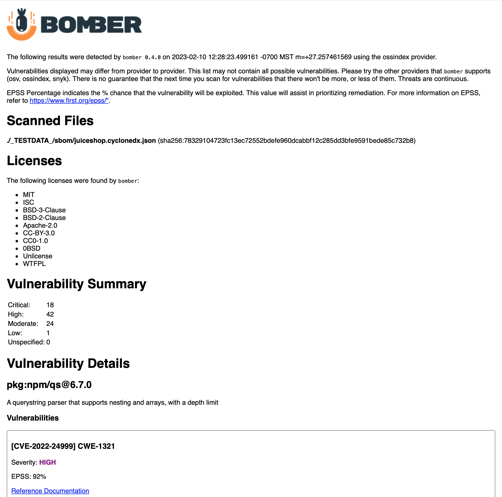

[](CONTRIBUTING.md)
 
[](https://goreportcard.com/report/github.com/devops-kung-fu/bomber) 
[](https://bestpractices.coreinfrastructure.org/projects/6409)
[](https://codecov.io/gh/devops-kung-fu/bomber) 
[](sbom/bomber.cyclonedx.json)


```bomber``` is an application that scans SBOMs for security vulnerabilities.

## Overview

So you've asked a vendor for an Software Bill of Materials (SBOM) for one of their closed source products, and they provided one to you in a JSON file... now what?

The first thing you're going to want to do is see if any of the components listed inside the SBOM have security vulnerabilities, and what kind of licenses these components have. This will help you identify what kind of risk you will be taking on by using the product. 

Finding security vulnerabilities and license information for components identified in a SBOM is exactly what ```bomber``` is meant to do. ```bomber``` can read any JSON or XML based [CycloneDX](https://cyclonedx.org) format, or a JSON [SPDX](https://spdx.dev) or [Syft](https://github.com/anchore/syft) formatted SBOM, and tell you pretty quickly if there are any vulnerabilities. 

### Open vs. Closed Source

Software can either be open or closed source. You can look at third party components you'll find in Github, or any public source repository as open source. Technically, the software you create internally at your own company is open source as well - it's not public, but your internal teams can see it. Closed source software can also be internal, but usually this is software that you purchase from external vendors. 

Companies can use SCA tools provided by vendors such as Github, Sonatype, Snyk, etc. to scan any kind of open source and provide vulnerability data - and even generate SBOMs in some cases. What they can't do (yet...) is scan closed source software that you don't have visibility into. This is where SBOMs and ```bomber``` come into play. SBOMs provide the composition of software that you can't access, and ```bomber``` determines if anything in the SBOM has vulnerabilities.

### Purpose

We created ```bomber``` to scan the closed source SBOMs that are provided when you receive them from vendors. It can scan open source SBOMs too, and technically you could use ```bomber``` as an open source SCA tool if you wanted to.


### Supported SBOM formats

There are quite a few SBOM formats available today. ```bomber``` supports the following:

- [SPDX](https://spdx.dev)
- [CycloneDX](https://cyclonedx.org)
- [Syft](https://github.com/anchore/syft)

## Providers


```bomber``` supports multiple sources for vulnerability information. We call these *providers*. Currently, ```bomber``` uses [OSV](doc/providers/osv.md) as the *default* provider, but you can also use the [Sonatype OSS Index](doc/providers/ossindex.md), or [Snyk](doc/providers/snyk.md).

At this time, please note that [OSV](doc/providers/osv.md) is free and does not require any credentials to use, [Sonatype OSS Index](doc/providers/ossindex.md) is free but requires you to register and obtain a token, and [Snyk](doc/providers/snyk.md) support requires a Snyk license.

In addition to data ```bomber``` collects from Providers, it also [enriches](#data-enrichment) vulnerability data with extra information such as exploitation probabilities.

### Provider Support

Please note that *each provider supports different ecosystems*, so if you're not seeing any vulnerabilities in one, try another. An ecosystem is simply the package manager, or type of package. Examples include rpm, npm, gems, etc. It is important to understand that each provider may report different vulnerabilities. If in doubt, look at a few of them.

If ```bomber``` does not find any vulnerabilities, it doesn't mean that there aren't any. All it means is that the provider being used didn't detect any, or it doesn't support the ecosystem. Some providers have vulnerabilities that come back with no Severity information. In this case, the Severity will be listed as "UNDEFINED"

### Provider Documentation

Provider documentation for ```bomber``` can be found:

* [OSV](doc/providers/osv.md)
* [OSSINDEX](doc/providers/ossindex.md)
* [Snyk](doc/providers/snyk.md)

## Installation

### Mac

You can use [Homebrew](https://brew.sh) to install ```bomber``` using the following:

``` bash
brew tap devops-kung-fu/homebrew-tap
brew install devops-kung-fu/homebrew-tap/bomber
```

If you do not have Homebrew, you can still [download the latest release](https://github.com/devops-kung-fu/bomber/releases) (ex: ```bomber_0.1.0_darwin_all.tar.gz```), extract the files from the archive, and use the ```bomber``` binary.  

If you wish, you can move the ```bomber``` binary to your ```/usr/local/bin``` directory or anywhere on your path.

### Linux

To install ```bomber```,  [download the latest release](https://github.com/devops-kung-fu/bomber/releases) for your platform and install locally. For example, install ```bomber``` on Ubuntu:

```bash
dpkg -i bomber_0.1.0_linux_arm64.deb
```

## Using bomber

You can scan either an entire folder of SBOMs or an individual SBOM with ```bomber```.  ```bomber``` doesn't care if you have multiple formats in a single folder. It'll sort everything out for you.

Note that the default output for ```bomber``` is to STDOUT. Options to output in HTML or JSON are described later in this document.

### Single SBOM scan

``` bash
# Using OSV (the default provider) which does not require any credentials
bomber scan cyclonedx.sbom.json

# Using a provider that requires credentials (ossindex)
bomber scan --provider=xxx --username=xxx --token=xxx spdx-sbom.json
```
If the provider finds vulnerabilities you'll see an output similar to the following:


If the provider doesn't return any vulnerabilities you'll see something like the following:


### Entire folder scan

This is good for when you receive multiple SBOMs from a vendor for the same product. Or, maybe you want to find out what vulnerabilities you have in your entire organization. A folder scan will find all components, de-duplicate them, and then scan them for vulnerabilities.

```bash
# scan a folder of SBOMs (the following command will scan a folder in your current folder named "sboms")
bomber scan --provider=xxx --username=xxx --token=xxx ./sboms
```

You'll see a similar result to what a Single SBOM scan will provide.

## Output Formats

```bomber``` outputs data into three useful formats. By default, output is rendered to the command line. For enhanced reporting, you can output to HTML using the ```--output=html``` flag. To output to JSON, utilize the ```--output=json``` flag.

### HTML Output

If you would like a readable report generated with detailed vulnerability information, you can utilized the ```--output``` flag to save a report to an HTML file.

Example command:

``` bash
bomber scan bad-bom.json --output=html
```

This will save a file in your current folder in the format "YYYY-MM-DD-HH-MM-SS-bomber-results.html". If you open this file in a web browser, you'll see output like the following:



### JSON Output

```bomber``` can output vulnerability data in JSON format using the ```--output``` flag. The default output is to STDOUT. There is a ton of more information in the JSON output than what gets displayed in the terminal. You'll be able to see a package description and what it's purpose is, what the vulnerability name is, a summary of the vulnerability, and more.


Example command:

``` bash
bomber scan bad-bom.json --output=json > filename.json
```

## Data Enrichment

```bomber``` has the ability to enrich vulnerability data it obtains from the [Providers](#providers). The first "enricher" we have implemented for is for [EPSS](https://www.first.org/epss/)

### Exploit Prediction Scoring System (EPSS)

[EPSS](https://www.first.org/epss/) stands for Exploit Prediction Scoring System and is framework that predicts the probability of a vulnerability being exploited. [EPSS](https://www.first.org/epss/) is often used to help in identifying high risk vulnerabilities to prioritize for remediation. 

[EPSS](https://www.first.org/epss/) uses a percentage for probability. So if you see 94, the score is that is trying to say that vulnerability has a 94% probability of exploitation.  And it stands to reason that a vulnerability with a score like 94, is something that deserves immediate attention, where a vulnerability with a score of like say 20 deserves to take a lower priority.

## Advanced stuff

If you wish, you can set two environment variables to store your credentials, and not have to type them on the command line. Check out the [Environment Variables](####Environment-Variables) information later in this README.

### Scanning SBOMs from STDIN

If you're using ```bomber``` in your CI/CD pipelines, you can do an all in one command with Syft to generate and scan a SBOM for vulnerabilities. To do this, you can do something like the following command:

``` bash
# Make sure you include the - character at the end of the command. This triggers bomber to read from STDIN
syft packages . -o cyclonedx-json | bomber scan --provider ossindex --output json - 
```
This command creates a SBOM, pipes it into bomber, and generates results in JSON format.

### Environment Variables

If you don't want to enter credentials all the time, you can add the following to your ```.bashrc``` or ```.bash_profile```

``` bash
export BOMBER_PROVIDER_USERNAME={{your OSS Index user name}}
export BOMBER_PROVIDER_TOKEN={{your OSS Index API Token}}
```

### Messing around

If you want to kick the tires on ```bomber``` you'll find a selection of test SBOMs in the [test](sbom/test/) folder. 

## Notes

- It's pretty rare to see SBOMs with license information. Most of the time, the generators like Syft need a flag like ```--license```. If you need license info, make sure you ask for it with the SBOM.
- Hate to say it, but SPDX is a train wreck. If you don't get any results on an SPDX file, try using a CycloneDX file. In general you should always try to get CycloneDX SBOMs from your vendors.
- OSV. It's great, but the API is also wonky. They have a batch endpoint that would make it a ton quicker to get information back, but it doesn't work. ```bomber``` needs to send one PURL at a time to get vulnerabilities back, so in a big SBOM it will take some time. We'll keep an eye on that.

## Contributing

If you would like to contribute to the development of ```bomber``` please refer to the [CONTRIBUTING.md](CONTRIBUTING.md) file in this repository. Please read the [CODE_OF_CONDUCT.md](CODE_OF_CONDUCT.md) file before contributing.

## Software Bill of Materials

```bomber``` uses Syft to generate a Software Bill of Materials every time a developer commits code to this repository (as long as [Hookz](https://github.com/devops-kung-fu/hookz) is being used and is has been initialized in the working directory). More information for CycloneDX is available [here](https://cyclonedx.org).

The current CycloneDX SBOM for ```bomber``` is available [here](./sbom/bomber.cyclonedx.json).

## Credits

A big thank-you to our friends at [ZERO](https://zero.health) for the ```bomber``` logo.

Thank you to [Sonatype](https://sonatype.com) for providing a wicked tool like the [Sonatype OSS Index](https://ossindex.sonatype.org).

Many thanks to our friends and fellow ```bomber``` contributors at [Snyk](https://snyk.io) for creating a provider, and coding up processing a SBOM from STDIN. You guys rock.

EPSS description comes from the team at [Nucleus](https://nucleussec.com/blog/what-is-epss/). Thank you!